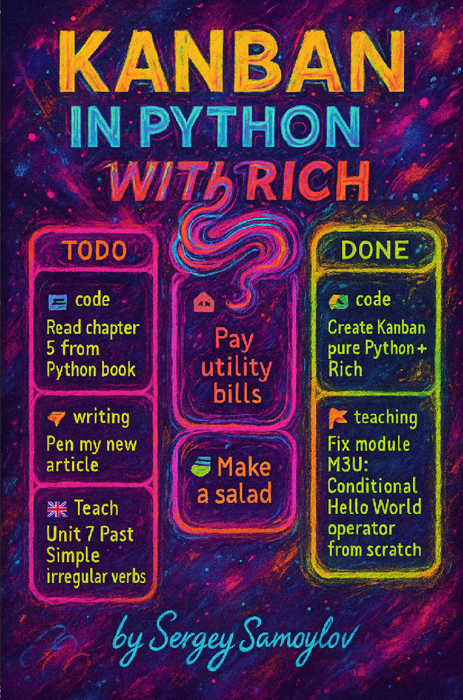

# 🧮 Канбан-доска в терминале

Элегантная **канбан-доска прямо в терминале**,  
построенная с помощью библиотеки [Rich](https://github.com/Textualize/rich).  

Задачи организованы по статусам:  
**TODO**, **NOW** и **DONE**,  
и могут отображаться  
**как по горизонтали, так и по классическим колонкам**.

Каждая задача имеет свою **категорию**,  
которой присваивается **уникальный цвет** для удобства визуальной группировки.

Данные хранятся в обычном **CSV-файле**,  
конфигурация — в виде **Python-словаря**.

---

## 🛠 Возможности

- 📦 Три статуса задач: `TODO`, `NOW`, `DONE`
- 🗂 Задачи включают `id`, `заголовок`, `описание`, `категорию`, `статус`
- 🎨 Поддержка пользовательских категорий с постоянными цветами
- ⌨️  Команды в стиле Vim: `:a`, `:m`, `:w`, `:q`
- 🧠 Умное переиспользование ID
- 🔁 Переключение между вертикальной и горизонтальной раскладкой
- 🔍 Фильтрация, сортировка и поиск задач
- 🧹 Чистый и стильный интерфейс с панелями Rich

---



---


## 🚀 Быстрый старт

### 📦 Требования

- Python 3.10+
- Библиотека `rich`

Установка зависимостей:

```bash
sudo apt install python3-rich
```

или

```bash
pip install rich
```

### ▶️ Запуск приложения

```bash
python main.py
```

---

## ⌨️ Команды

| Команда     | Описание                            |
|-------------|--------------------------------------|
| `:a`        | Добавить новую задачу                |
| `:m`        | Переместить задачу в другой статус   |
| `:d`        | Удалить задачу                       |
| `:e`        | Редактировать задачу                 |
| `:f`        | Фильтр по статусу или категории      |
| `:s`        | Сортировка по ID, заголовку, категории |
| `:search`   | Поиск текста по задачам              |
| `:c`        | Изменить цвет категории              |
| `:layout`   | Переключить раскладку (колонки/ряды) |
| `:w`        | Сохранить изменения                  |
| `:q`        | Выйти из приложения                  |
| `:clear`    | Перерисовать доску                   |

---

## 📂 Структура проекта

```
kanban/
├── main.py            # Точка входа
├── board.py           # Отображение канбан-доски
├── task.py            # Класс задачи и логика
├── storage.py         # Загрузка/сохранение CSV
├── config.py          # Конфигурация в виде словаря
├── config_utils.py    # Утилиты для работы с конфигом
├── /db/tasks.csv      # База задач
├── README.md          # О проекте на английском
├── README_RU.md       # Данный файл
├── StyleGuide.md      # Руководство по стилю (оформление кода)
```

---

## ⚙️ Конфигурация

Все настройки (цвета категорий, раскладка) хранятся в `config.py` как словарь:

```python
CONFIG = {
    "category_colors": {
        "code": "cyan",
        "shop": "green",
    },
    "layout": "columns"
}
```

Цвета для новых категорий назначаются случайно (без повторений), но их можно
изменить вручную через команду `:c`.

---

## 🧱 Масштабируемость

- Модульная архитектура.
- Легко заменить CSV на JSON или БД при необходимости.
- Готово для расширения (многопроектный режим и т.д.).

---

## ❤️ Сделано с Rich

Приложение использует замечательную библиотеку [Rich](https://github.com/Textualize/rich)  
для оформления интерфейса в терминале — спасибо, [Will McGugan](https://github.com/willmcgugan)!

---

## 📃 Лицензия

GNU General Public License.

